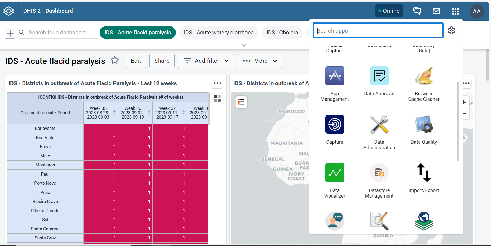
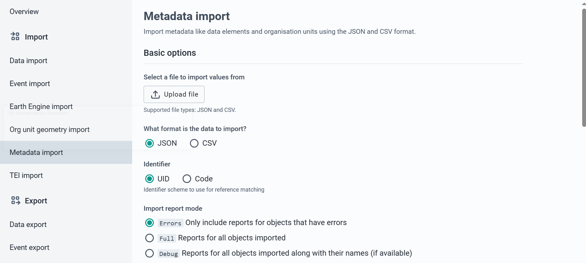

# Early_warning_system_ETL

## About the Project
In this project a Demo is presented, which shows as an example an ETL process in which we use ```GNU-Health`` as data source and ```DHIS2``` as destination.

## Notas
This repository originates from two different GNU-Health servers which aim to simulate the data of two Faculties.
- faculty1: Hospital_Adeje
- faculty2: sanitary_center_Adeje

## Environment and Configuration
#### Before you start, you need to have Docker installed.
#### All scripts are created with Python 3.9.

The versions of the libraries used were the latest currently available:

- Proteus 
- Pandas 
- Faker 
- Requests
- Collections
- Datetime
- Json

## Getting Started
To start using this demo we need to create images of the ``GNU-Health Client``, Tryton server, Postgres database and DHIS2.


To build the **Tryton Server** image, the following statement will be entered:

```bash
docker build -t opendx/gnu_health https://github.com/OpenDx28/gnu-health-server-docker.git#new_demo
```

**GNU Health GUI** consists of 2 steps:

```bash
1. docker build -t vnc-base https://github.com/OpenDx28/docker-vnc-base.git#:sr

2. docker build -t gnu-hc --build-arg BASE_IMAGE="vnc-base:latest" https://github.com/OpenDx28/docker-gnu-hc.git#:src
```

**Postgres** Database: 

This image will be automatically downloaded later when you run docker-compose up -d.

To create the **DHIS2** container we have to clone the repository found at this link:

``` bash 
https://github.com/paulavmf/opendx_course/tree/master/dhis2
```

**Container_etl**:

We have a dockerfile which will build an image of our container with all our scripts and csv:

to build it we will use:

```bash 
docker build -t etl .
```

Once we have all the images and the DHIS2 repository, we will proceed to launch the following command which will bring up the whole system we need

```bash
docker-compose up -d
```

With everything up, these containers (Gnu-client, 2 tryton servers (one for each faculty), container_etl and dhis2) should be up and accessing the gnu client and DHIS2 system interfaces.

The last step would be to run our main.py file inside our container_etl, to launch the whole etl process and leave everything in its destination.

```bash
docker exec -it etl_container-1 python main.py
```

### Note about windows
From the windows docker desktop itself we have an option to start and shut down the compose we have, from there we go into each of them and we can click on a link that will open the interfaces mentioned above.


### credentials:

```
gnu-client
■ user: admin
■ pass: gnusolidario
```
```
Dhis2
■ user: admin
■ pass: district
```

## Container_etl
### Conexiones
In our container we have a csv called datacon.csv in which we have all the information about the connection to our tryton server and DHIS2.


### DHIS2
It may happen that you need to enter the dhis2 metadata once the container is up, then you should enter dhis2 and insert the files you have in the folder
metadata folder and insert them in their order.

In the right panel we should look for Import/export and click on



once inside in the metadata import section, you will see a window like this, now you must select the files one by one and click on upload file.



When we have finished we can see that several dashboards are loaded and we have some datasets, orgunit, dataelement, etc...
